# PAAC-mobile

Port Authority of Allegheny County (PAAC) mobile application. The whole project was conducted by a group of 5 people and finished in 3 days.

## Getting Started

These instructions will get you a copy of the project up and have an idea about the PAAC mobile application.

### Prerequisites

* You will need a MacOS and Xcode to run and test the iOS client. 
* You will need to install Java, nodejs and npm to run the Android client.

### Design and screenshots
## Mobile platform

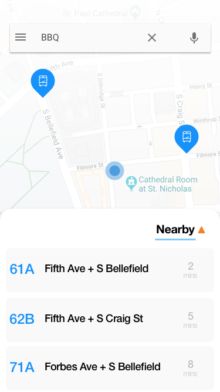
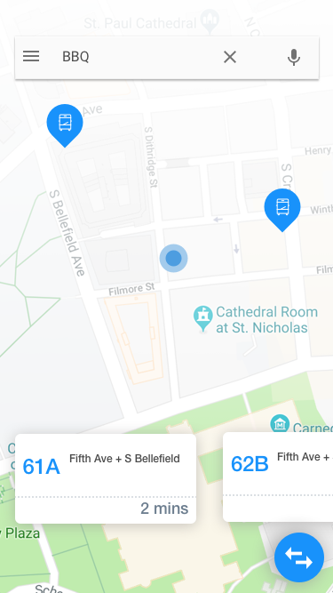
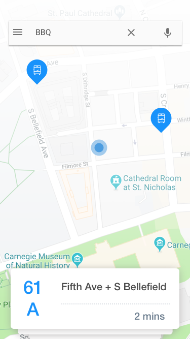
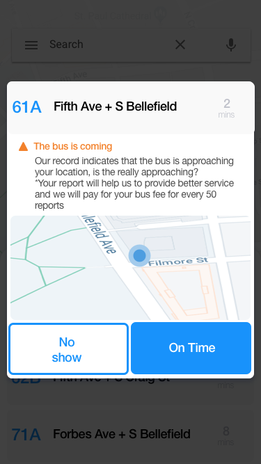
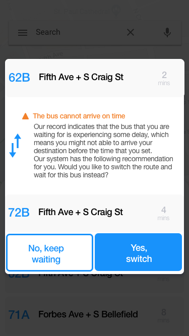
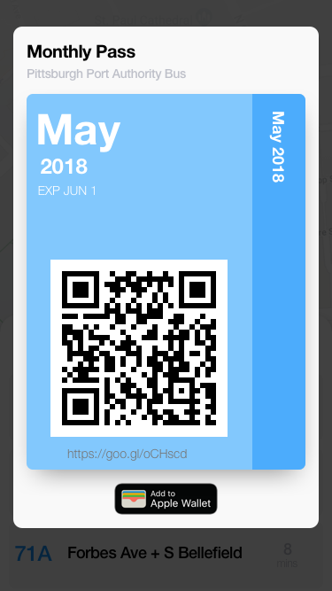
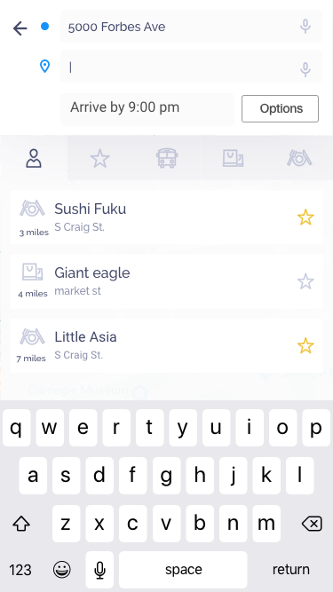
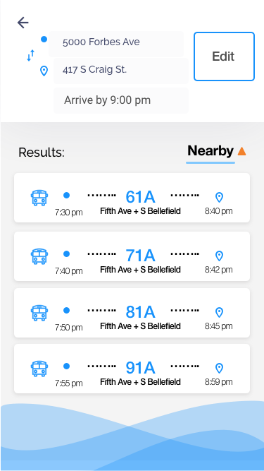
## Smart Watch (Just design, no implementation)
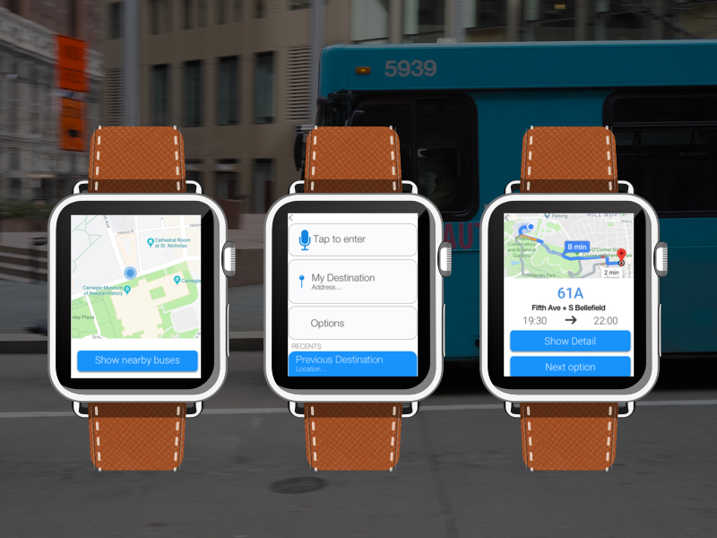

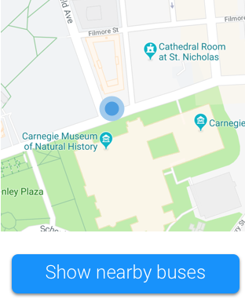

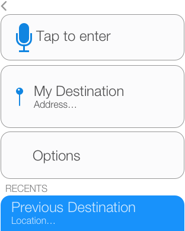
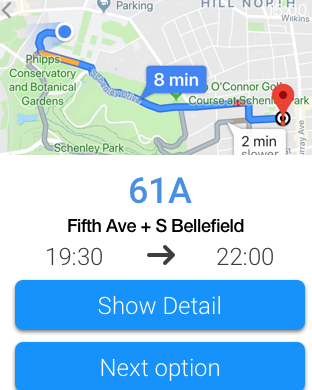

## Authors

Please refer to their GitHub pages to see their amazing repos.

* **Jiajun Chen(Carson)** - *UI design, Android Client*
* **Buqian Zheng** - *iOS Client* [Buqian Zheng](https://github.com/zhengbuqian)
* **Hongdi Zhang** - *User requirement survey, data analysis, testing* [Hongdi Zhang](https://github.com/eddyzhd)
* **Chunyi Cui** - *Cost estimation, data analysis, testing* [Chunyu Cui](https://github.com/JaneCui)
* **Xiaoxi Liu** - *Usability survery, data analysis, testing* [Xiaoxi Liu](https://github.com/josie00)

## License

This project is licensed under the MIT License.

## Acknowledgments

